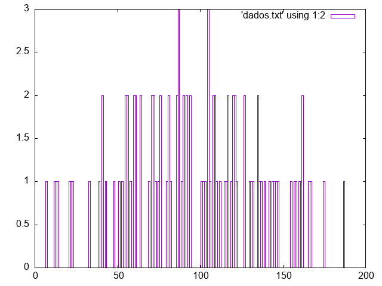
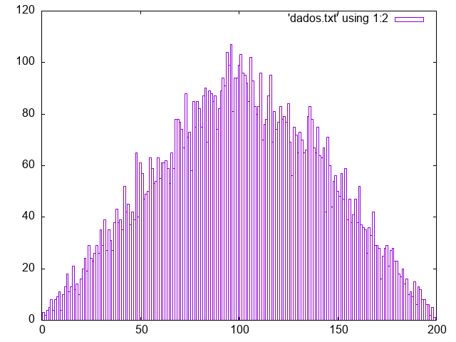
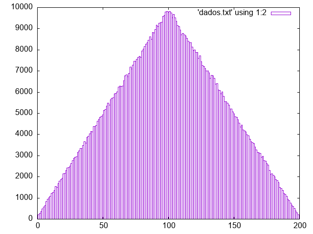

# Programinha em C que soma dois números aléatorios de 0 até um número x uma certa quantidade de vezes e cria um arquivo de dados para plotagem de gráfico.

Percebe-se que, quanto maior o número de repetições, mais o gráfico se aproxima de um triângulo, legal. 

Alguns gráficos feitos com o programa (x = 200):

10 repetições:

100 repetições:

1000 repetições:

10000 repetições:

100000 repetições:

1000000 repetições:

10000000 repetições:

100000000 repetições:

1000000000 repetições:

